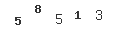
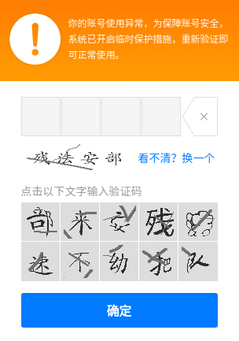
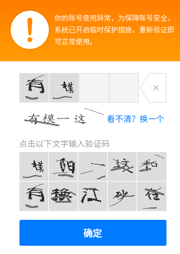

# 验证码

该示例的主要目的是为了学习如何使用 PHP 来生成验证码。

包括以下示例：

- [basic][1] PHP 验证码基础示例，[参考1][4]
- [securimage][2] [Securimage][5] 的使用示例
- [chinese][3] 基于 [Securimage][5] 开发的中文验证码示例

## 安装

本项目可正常运行在 PHP 7 版本，需要安装 GD 扩展。

Nginx 可参考以下配置：

```nginx
# /etc/nginx/sites-enabled/captcha.conf
server {
	listen 80;
	server_name captcha.example.com;
	root /www/web/captcha-demo;

	location ~ \.php {
        include /etc/nginx/fastcgi.conf;
		fastcgi_pass   127.0.0.1:9000;
	}
}
```

## 截图演示

http://captcha.example.com/basic/demo1.php



http://captcha.example.com/chinese/index.html



中文验证码输入时的样子



当然，你可以点击 X 将已输入的验证码清空。

[1]: basic
[2]: securimage
[3]: chinese
[4]: https://www.the-art-of-web.com/php/captcha/
[5]: https://www.phpcaptcha.org/